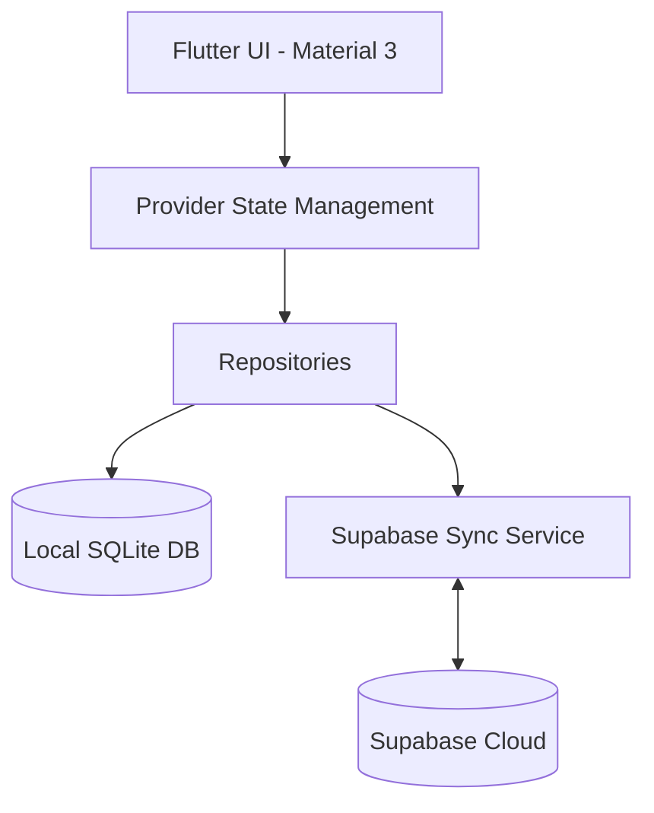

# 🛡️ Sheikh Al Jabal — Backup POS System

[](https://flutter.dev)
[](https://supabase.com)
[](https://www.sqlite.org)
[](https://github.com/assadAllah630/Backup_POS)

A professional, offline-first Point of Sale (POS) solution designed for high-reliability retail environments. Built to handle the unique challenges of modern commerce in Lebanon, including dual-currency support and intermittent connectivity.

---

## ✨ Key Pillars

### 🚀 Offline-First Reliability
The core system operates entirely on a local **SQLite** database. Transactions, customer debts, and inventory updates are processed instantly without needing an active internet connection.

### 🔄 Smart Cloud Sync
When online, the app seamlessly synchronizes with **Supabase**. It uses a sophisticated background queue to push local changes and pull cloud updates, ensuring all devices stay in harmony without blocking the user interface.

### 💵 Lebanese Market Optimized
- **Dual Currency:** Real-time switching and display of both **LBP** and **USD**.
- **Dynamic Exchange Rates:** Easily adjustable rates via the settings panel.
- **WhatsApp Integration:** Send receipts and debt statements directly to customers via WhatsApp in Arabic.

### 🔐 Advanced Security
- **Device Handshake:** Secure registration flow ensuring only authorized hardware can access the system.
- **Role-Based Access:** PIN-protected screens for Admin and Staff actions.
- **Audit Logging:** Every critical action is logged for transparency.

---

## 🛠️ Features at a Glance

- 📦 **Inventory Management:** CSV import/export, low-stock alerts, and expiry date tracking.
- 💳 **Debt Tracking:** Comprehensive customer ledger with history and payment processing.
- 📊 **Analytics:** Visual sales reports and shift summaries using `fl_chart`.
- 🖨️ **PDF Generation:** Professional receipt printing and PDF exports.
- 📱 **Mobile & Tablet Optimized:** Responsive UI with smooth micro-animations.

---

## 📸 Screenshots

<div align="center">
  
  
  <br />
  
  
</div>

---

## 🏗️ Architecture



---

## 🚀 Getting Started

### Prerequisites
- [Flutter SDK](https://docs.flutter.dev/get-started/install)
- [Dart SDK](https://dart.dev/get-started)

### Installation
1. Clone the repository:
   ```bash
   git clone https://github.com/assadAllah630/Backup_POS.git
   ```
2. Install dependencies:
   ```bash
   flutter pub get
   ```
3. Run the application:
   ```bash
   flutter run
   ```

---

## 🎨 Design Aesthetics
The application features a premium **Glassmorphism** dark theme, utilizing `flutter_animate` for subtle transitions and `google_fonts` (Inter & Outfit) for a modern, readable typography.

---

Developed with ❤️ for **Sheikh Al Jabal (شيخ الجبل)**.
