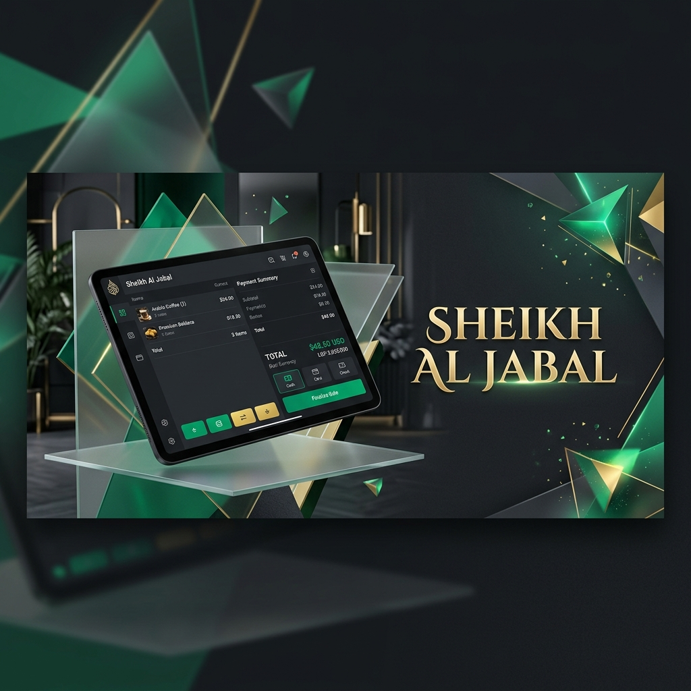
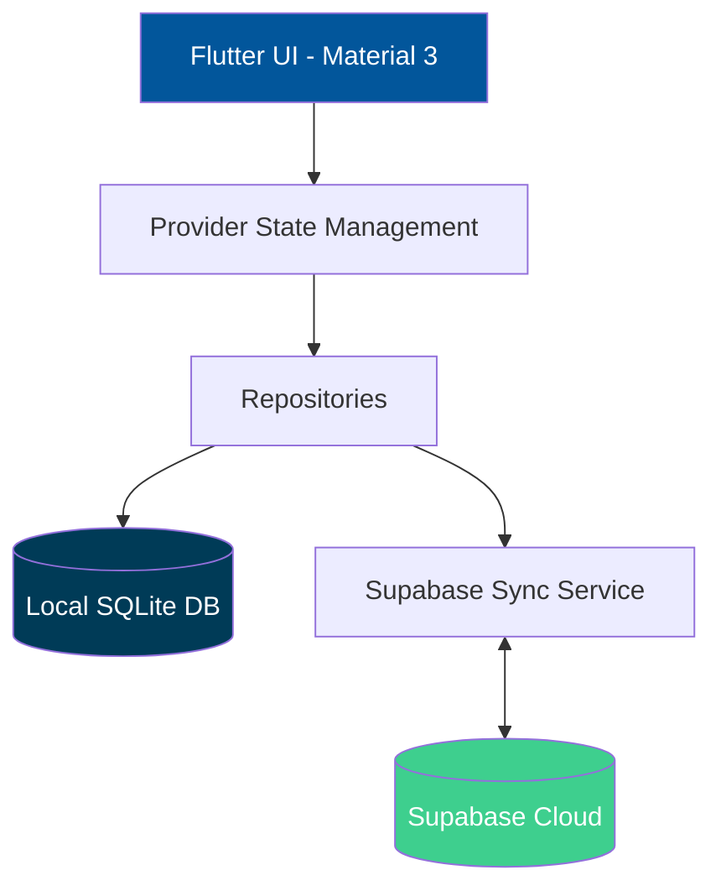

<div align="center">

# 🛡️ Sheikh Al Jabal — Backup POS System



[](https://flutter.dev)
[](https://supabase.com)
[](https://www.sqlite.org)
[](https://github.com/assadAllah630/Backup_POS)

**A professional, offline-first Point of Sale (POS) solution designed for high-reliability retail environments.**

[Features](#-key-pillars) • [Screenshots](#-screenshots) • [Architecture](#-architecture) • [Getting Started](#-getting-started)

</div>

---

## ✨ Key Pillars

| 🚀 Offline-First | 🔄 Smart Cloud Sync | 💵 Market Optimized |
|:---:|:---:|:---:|
| Operates 100% on local **SQLite**. No internet? No problem. | Seamless background sync with **Supabase** when online. | **Dual Currency** (USD/LBP) & WhatsApp integration. |

### 🛠️ Core Capabilities
*   **Inventory Management:** Smart CSV import/export & real-time stock tracking.
*   **Debt Tracking:** Complete customer ledgers with history & payment processing.
*   **Security:** Device-handshake registration & PIN-protected access control.
*   **Analytics:** Interactive sales reports & shift summaries via `fl_chart`.

---

## 📸 Screenshots

<div align="center">
  <table border="0">
    <tr>
      <td></td>
      <td></td>
    </tr>
    <tr>
      <td></td>
      <td></td>
    </tr>
  </table>
</div>

---

## 🏗️ Architecture

The system follows a robust, repository-based architecture to ensure data integrity across local and cloud layers.



---

## 🎨 Visual Identity & Aesthetics
The application is built with a **Premium Dark Theme** optimized for high-contrast retail environments.
- **Glassmorphism:** Subtle blur effects and frosted-glass cards for a modern feel.
- **Micro-Animations:** Powered by `flutter_animate` for responsive user feedback.
- **Typography:** Professional font pairings (Inter & Outfit) via `google_fonts`.

---

## 🚀 Getting Started

### Prerequisites
- [Flutter SDK](https://docs.flutter.dev/get-started/install)
- [Dart SDK](https://dart.dev/get-started)

### Installation
```bash
# 1. Clone the repository
git clone https://github.com/assadAllah630/Backup_POS.git

# 2. Install dependencies
flutter pub get

# 3. Run the app
flutter run
```

---

<div align="center">
Developed with ❤️ for **Sheikh Al Jabal (شيخ الجبل)**.
</div>
